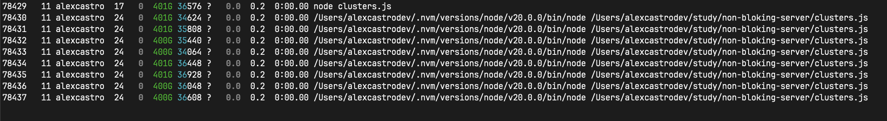

# Node.js - Non Bloking Server I/O

[Também em pt-BR](readme-PT.md)

This project is a simple example of a non blocking server I/O using Node.js.

We have 4 API endpoints:

- / => for testing and return a simple message
- /blocking => for testing and return a simple message but with a blocking function
- /fork => for testing and return a simple message but with a fork function
- /worker => for testing and return a simple message but with a worker function

# Requirements

- Node.js 20.x ( just for clusters )

if you want to use the fork or worker endpoints, you can use Node.js 18.x LTS

## How to run

- Clone this repository

- Run `npm install`

- Run `npm start`

## Explanation

In Node.js, both forks and worker threads are mechanisms for achieving parallelism and concurrency, but they differ in their underlying implementations and use cases.

### Fork

- Forking refers to the creation of a new child process that is a replica of the parent process. The child process runs as a separate entity and has its own memory space.

- When forking a process, you essentially create a new instance of the Node.js runtime, allowing you to leverage multiple CPU cores and distribute the workload.

- Forking is typically used for parallel processing, such as running multiple instances of a server or handling computationally intensive tasks. Communication between the parent and child processes is achieved through inter-process communication (IPC) mechanisms like sockets, pipes, or messages.

- The child_process module in Node.js provides the functionality for forking child processes.

### Worker Threads

- Worker threads, on the other hand, are lightweight threads within a single Node.js process. They allow you to execute JavaScript code concurrently within the same memory space.
Worker threads are useful for offloading CPU-intensive tasks and taking advantage of multiple cores without creating separate processes.

- Worker threads enable parallel execution, but they share memory with the parent thread, allowing for efficient communication and data sharing without the overhead of inter-process communication.

- The worker_threads module in Node.js provides the API for creating and managing worker threads.
In summary, forking creates separate processes with their own memory space, while worker threads are lightweight threads within a single process that share memory. Forking is typically used for parallel processing and distributing work across multiple cores, while worker threads are suitable for concurrent execution and offloading CPU-intensive tasks within a single process.


# Clusters

DISCLAIMER: This does not replace a load balancer like Nginx or HAProxy. Rather, it is a way to scale an application across multiple CPUs and cores.

- Clusters are a way to scale up an application by delegating tasks to multiple worker processes. They are useful for taking advantage of multi-core systems and optimizing resource utilization.

- A cluster is a pool of similar workers running under a parent Node.js process. The parent process is called the master, and the workers are called slaves.

- The cluster module in Node.js provides an easy way of creating child processes that all share server ports.

- The cluster module supports two methods of distributing incoming connections.



Note that the PORT are shared, so if you run the application in the same machine, like:

```bash
$ node clusters.js
Primary 79037 is running ~ numCPUs 8
Worker 79038 started
Worker 79038 listening on port http://[::1]:3000
Worker 79039 started
Worker 79039 listening on port http://[::1]:3000
Worker 79040 started
Worker 79040 listening on port http://[::1]:3000
Worker 79042 started
Worker 79042 listening on port http://[::1]:3000
Worker 79044 started
Worker 79044 listening on port http://[::1]:3000
Worker 79045 started
Worker 79045 listening on port http://[::1]:3000
Worker 79043 started
Worker 79043 listening on port http://[::1]:3000
Worker 79041 started
Worker 79041 listening on port http://[::1]:3000
```

You will see that the port 3000 is shared between the workers.

and if you open the browser and access the endpoint http://localhost:3000/blocking, you will see that the request will be handled by one of the workers.

It will block one of workers, and if you try to access the endpoint http://localhost:3000, will be handled by another worker.

If you open the browser and access the endpoint http://localhost:3000/blocking will be blocked again.

if you open many tabs in the browser and access the endpoint http://localhost:3000/blocking, you will break the aplication, LOOOL XD

Like i did here:


References:

- https://nodejs.org/api/child_process.html

- https://nodejs.org/api/worker_threads.html

- https://www.freecodecamp.org/news/node-js-child-processes-everything-you-need-to-know-e69498fe970a/